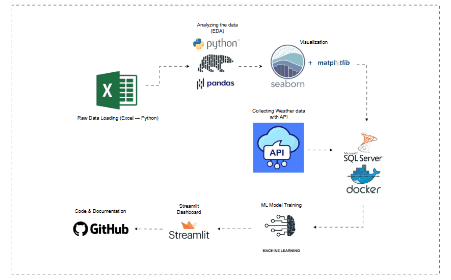

# Coffee Shop Sales Analysis - End To End Project

An end-to-end data analysis project focused on coffee shop sales, combining sales data with external weather data to perform data analysis, visualization, machine learning forecasting, and present insights through an interactive Streamlit dashboard.

## Project Overview

This project aims to analyze coffee shop sales data and integrate external weather information via an API to build an interactive Streamlit dashboard. The goal is to understand overall sales patterns, customer behavior, and potential relationships between weather conditions and product demand.

The project also includes a simple machine learning model to forecast sales based on historical sales and weather data. The model’s primary goal is to provide insights on how weather and other features impacts coffee shop sales.

## Project Workflow Diagram

Below is the workflow diagram illustrating the end-to-end process of the Coffee Shop Sales Analysis project, from data collection to dashboard deployment.

## Project Workflow

### **Data Collection**

- **Coffee shop sales data** is loaded from a local Excel file into Python.

- **Weather data** is collected from an external API.

---

### **Exploratory Data Analysis & Visualization**

Exploratory Data Analysis (EDA) was conducted to identify key patterns and trends in coffee shop sales data.
Visual insights were generated using Matplotlib and Seaborn to answer the following business questions:

**Time-Based Sales Analysis**

- When do sales peak by date, month, and hour?

- Which days and months generate the highest revenue?

**Product Performance Analysis**

- Which products and categories generate the highest and lowest revenue?

- Which products sell the highest quantities?

- How do product categories perform over time and across store locations?

**Store Location Analysis**

- How does sales performance vary across store locations?

- Which locations generate the highest monthly revenue?

---

### **Sales Analysis Summary**

- Sales revenue grows steadily from January to June 2023, peaking in June.

- Morning hours (7:00–11:00 AM) generate the highest sales.

- Monday leads in total revenue, while Friday has the highest transaction volume.

- Coffee is the top category by revenue and transactions.

- Barista Espresso is the highest revenue product.

- Hell’s Kitchen is the best-performing store location.

- Customers usually purchase 1–2 items per transaction, resulting in a low AOV.

---

### Key Metrics

| Metric                       | Value        |
|------------------------------|--------------|
| Total Revenue                | $698,812     |
| Total Transactions           | 149,116      |
| Average Order Value (AOV)    | $5.00        |
| Avg. Items per Transaction   | 1–2          |

---

### **Data Storage (Python → Dockerized MySQL)**

- Cleaned and processed sales data is stored in a **Dockerized MySQL database**.
- Weather data fetched from the API is also stored in the same database.
- This setup ensures structured storage, reproducibility, and readiness for modeling.

---

### **Machine Learning**

- Coffee sales data and daily weather data are retrieved from a Dockerized MySQL database.  
- A Random Forest model is built to predict daily sales.
- The model helps explore the relationship between weather conditions and sales performance.

---

### **Streamlit Dashboard**

- All insights and results are presented in an interactive **Streamlit dashboard**

## Team Members

- [**Zahra Abdullayeva**](https://github.com/zara-abdulla) 

- [**Ziyafet Rzayeva**](https://github.com/Ziyafat98)
